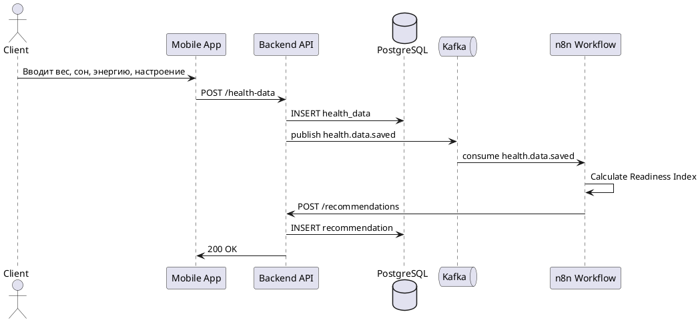
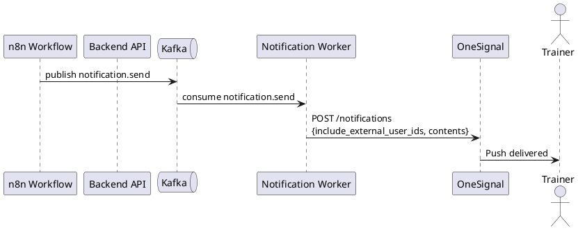

# Потоки данных

В этом разделе описаны ключевые последовательности взаимодействия между компонентами FitAdapt.

## Сценарий: ввод метрик и расчёт рекомендации

Клиент вводит показатели здоровья, backend сохраняет их и публикует событие в Kafka. n8n подхватывает событие, рассчитывает Readiness Index и инициирует формирование рекомендации.

## Сценарий: уведомление тренера

Если рассчитанный индекс готовности ниже порогового значения, система уведомляет тренера через push-канал.

## Правила оформления

- Каждая диаграмма сопровождается текстовым описанием.
- Для sequence-диаграмм используется PlantUML.
- Для сложных архитектурных схем — draw.io.
