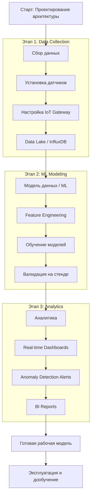

# Roadmap: Разработка ML-модели абстрактного водородного двигателя

Данный документ представляет собой верхнеуровневый план реализации проекта по созданию системы мониторинга и оптимизации водородного двигателя на основе машинного обучения.

## 1. Сбор данных (Data Collection)
Цель: Создать надежный фундамент данных для обучения моделей.

*   **Инструментарий:** IoT Gateway (MQTT/Kafka), InfluxDB (Time-series data), Airflow (ETL).
*   **Ключевые показатели:**
    *   Давление в камере сгорания.
    *   Температура выхлопных газов.
    *   Расход водорода и окислителя.
    *   Вибрационные характеристики.
*   **Этапы:**
    1.  Развертывание сети сенсоров и контроллеров.
    2.  Настройка потоковой передачи данных в Data Lake.
    3.  Очистка данных и обработка пропусков.

## 2. Модель данных и ML (Data Modeling)
Цель: Разработка предиктивной модели "цифрового двойника" двигателя.

*   **Инструментарий:** Python (Pandas, Scikit-learn, XGBoost/PyTorch), MLflow (Experiment tracking).
*   **Задачи:**
    *   **Feature Engineering:** Генерация признаков (термодинамические циклы, КПД).
    *   **Обучение:** Создание моделей предиктивного обслуживания (Predictive Maintenance) и оптимизации потребления топлива.
    *   **Валидация:** Тестирование модели на исторических данных и стендовых испытаниях.

## 3. Аналитика (Analytics)
Цель: Визуализация состояния системы и принятие управленческих решений.

*   **Инструментарий:** Grafana (Real-time dashboards), Superset/Tableau (BI reporting).
*   **Результаты:**
    *   Дашборды реального времени для инженеров.
    *   Система оповещений об аномалиях (Anomaly Detection).
    *   Прогнозные отчеты по остаточному ресурсу компонентов.

## Визуализация процесса (Roadmap Flow)

