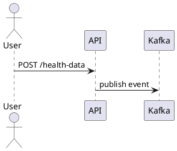

# Диаграммы

Диаграммы используются для визуализации архитектуры, потоков данных и моделей предметной области.

## Когда использовать PlantUML

PlantUML подходит для:
- Sequence-диаграмм (потоки данных, взаимодействие компонентов)
- Простых компонентных схем
- Диаграмм, которые удобно хранить как код и ревьюить в Git



## Когда использовать draw.io

draw.io подходит для:
- C4-диаграмм (Context, Container, Component)
- Сложных архитектурных схем с несколькими слоями
- Визуально насыщенных схем, требующих ручной доработки

Файлы `.drawio` хранятся в `static/diagrams/` и открываются через [app.diagrams.net](https://app.diagrams.net/).

## ASCII-диаграммы

Для простых схем допустимо использовать ASCII:

```text
Backend API → [Kafka] → n8n → [Kafka] → Notification Worker → OneSignal
```

## Обязательные правила

- Каждая диаграмма сопровождается **текстовым пояснением** до или после неё.
- Диаграмма имеет название и контекст использования.
- Если диаграмма сложная — рядом кратко описаны ключевые элементы и сценарий чтения.